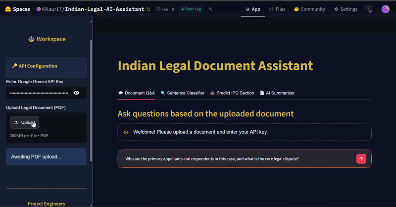
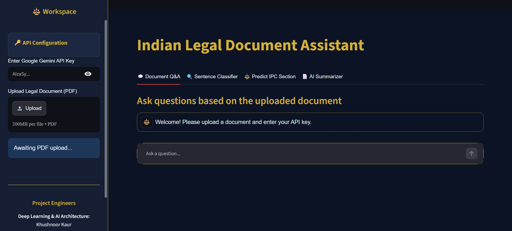
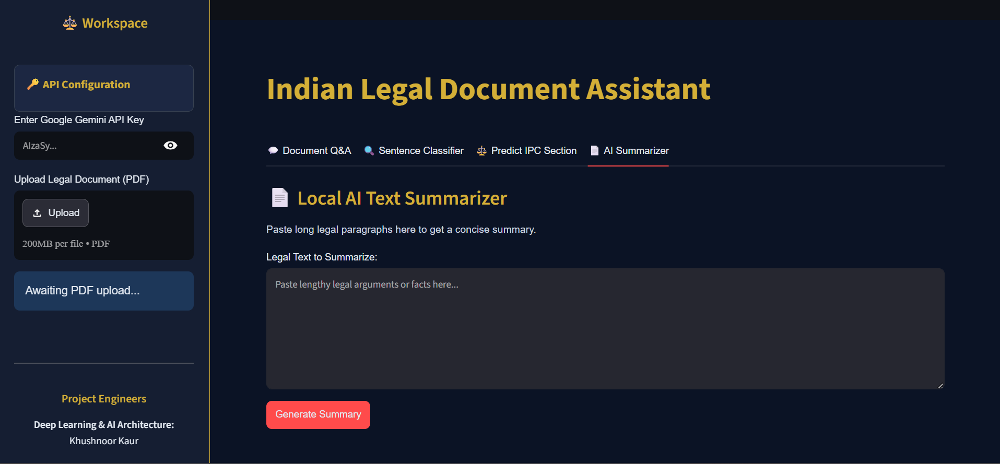
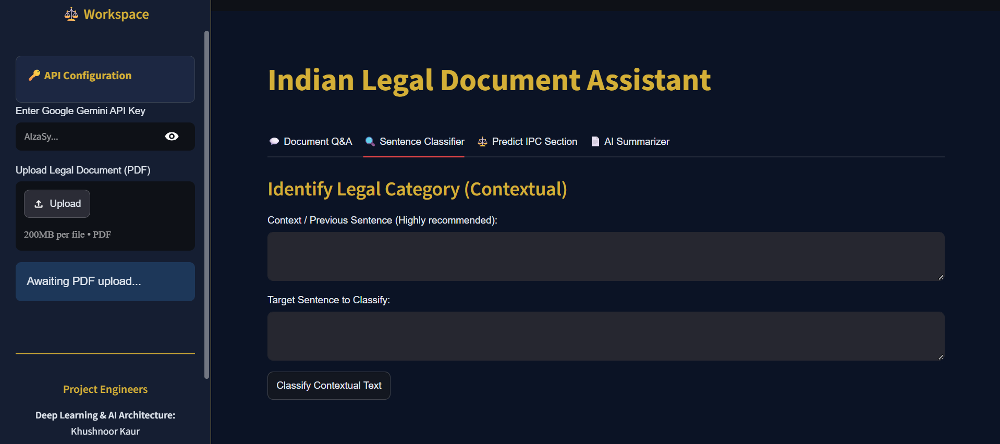
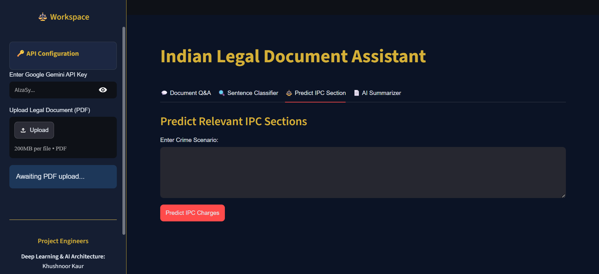
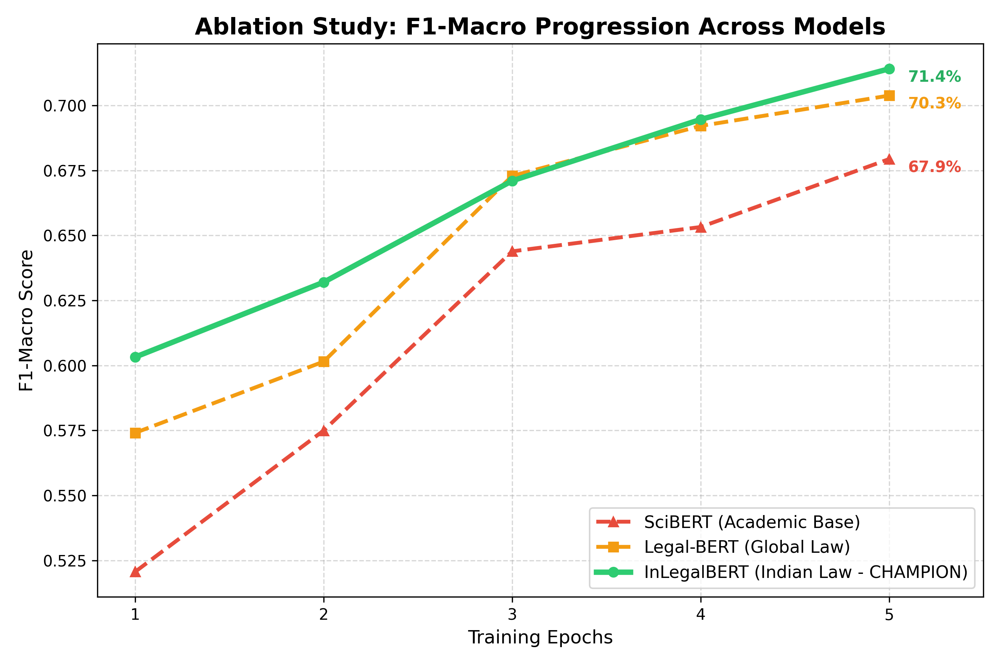
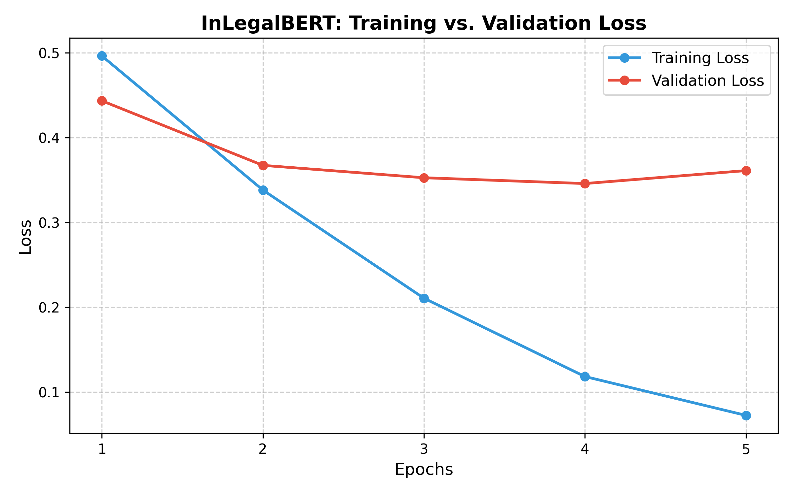
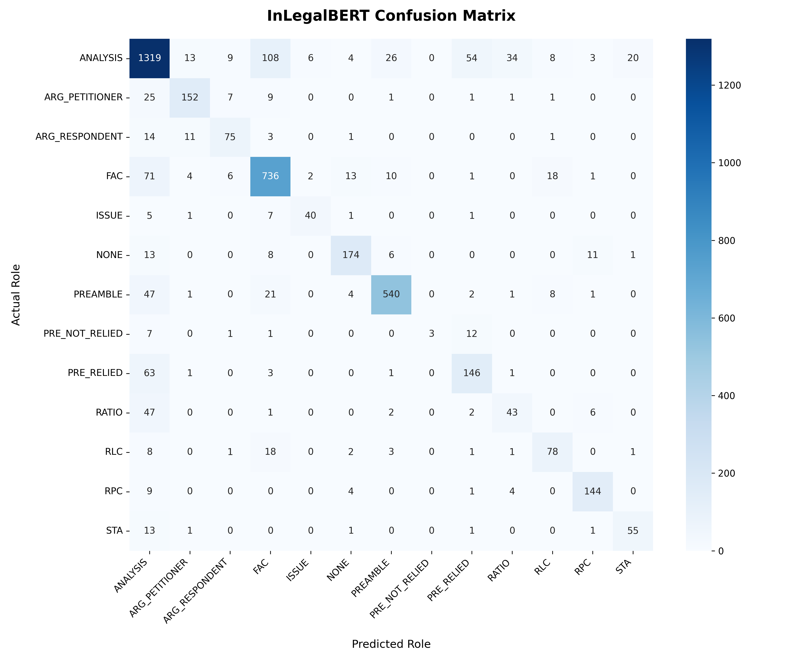
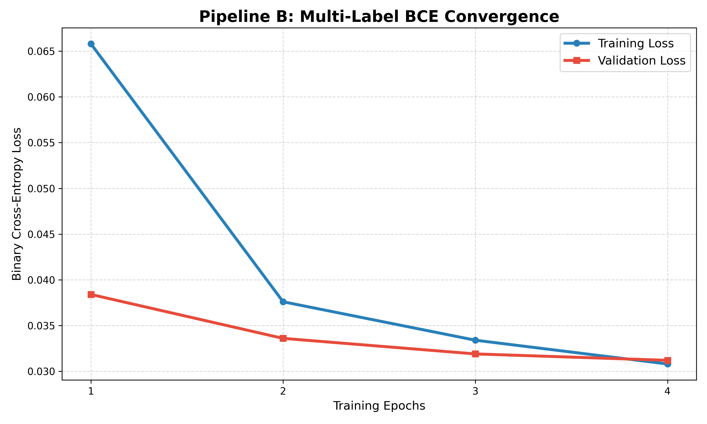
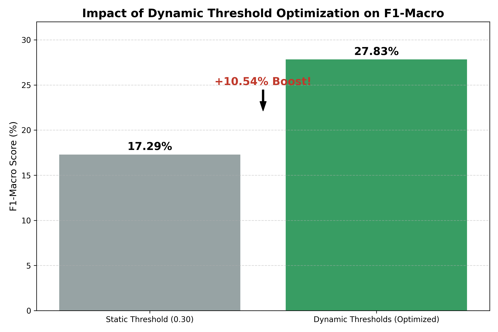

<div align="center">
  
#  Indian Legal AI Assistant (ILAA)


An advanced, multi-pipeline deep learning architecture engineered to automate legal intelligence extraction from highly complex, unstructured Indian Supreme Court judgments and legal legal records.

**[ Live Hugging Face Deployment](https://huggingface.co/spaces/KKaur17/Indian-Legal-AI-Assistant)** | **[ GitHub Repository](https://github.com/KKaur170/Indian-Legal-AI-Assistant)**

<br>

*(Demo: End-to-End Legal Analysis)*


</div>

---

##  Real-World Impact (Why This Matters)
The Indian judicial system handles an immense volume of pending cases trapped inside dense, unstructured documents. Legal professionals spend countless billable hours manually parsing case laws, FIRs, and petitions to extract core facts, isolate arguments, or discover applicable statutes. 

**ILAA transforms raw legal data into structured, actionable insights.** By replacing generic, one-size-fits-all models with specialized domain-specific architectures, this system drastically reduces cognitive load and eliminates the text-truncation and hallucination risks of generic conversational AI.

###  Approach Comparison
| Approach | Limitation | ILAA's Solution |
| :--- | :--- | :--- |
| **Generic ChatGPT** | Hallucinates statutes and lacks specific contextual boundary mapping. | Grounded Generation (RAG) tied strictly to document context. |
| **Traditional Keyword Search** | Misses semantic nuances and structural relations. | FAISS Semantic Vector Search with dynamic embedding matrices. |
| **Standard Text Classifiers** | Processes sentences blindly in isolation, breaking narrative flow. | Custom Sequence-Pair Legal Context Windows. |

---

##  Platform Architecture & User Interface

By merging core neural pipelines directly with an interactive dashboard UI, ILAA provides legal teams with a seamless, transparent analytical workbench.

### 1. Document Question Answering (RAG) & Private Summarization
* **RAG Flow:** `Raw Legal PDF` ➔ `PyPDF2 Text Extraction` ➔ `LangChain Semantic Chunking` ➔ `HuggingFace Embeddings` ➔ `FAISS Vector Store` ➔ `Context Retrieval` ➔ `Gemini 2.5 Flash Generation`
* **Privacy-Preserving Summarizer:** Runs entirely locally via a 12-layer encoder/12-layer decoder `facebook/bart-large-cnn` pipeline[cite: 1]. It handles document overflow through an NLTK sentence-tokenization chunking engine limited to a threshold of 400 words per block.




### 2. Context-Aware Rhetorical Role Classification
* **Architecture Flow:** `Sentence Splitting` ➔ `Sequence-Pair Formatting ([Prev] [SEP] [Current])` ➔ `InLegalBERT Core Encoder` ➔ `Multi-Class Focal Loss Head` ➔ `13 Legal Rhetorical Roles`



### 3. Multi-Label IPC Charge Predictor
* **Architecture Flow:** `Plain-English Crime Scenario` ➔ `legal-bert-base-uncased Tokenization` ➔ `Sliding Window Tiling` ➔ `Sigmoid Multi-Label Probability Layers` ➔ `Dynamic Threshold Calibration Matrix` ➔ `Applicable Penal Codes`



---

##  Training Analytics & Model Convergence

The underlying Transformer architectures underwent comprehensive training, parameter freezing, and evaluation against human-annotated legal data.

### Pipeline A: Rhetorical Role Classification (InLegalBERT)
Trained on the OpenNyAI BUILD dataset using a Stratified 85/15 split. To preserve legal vocabulary semantics while adjusting for task-specific reasoning, the base embeddings and bottom 6 layers were frozen, isolating updates to the top 6 encoder layers.

| Model Selection (Ablation Study) | Training vs. Validation Convergence |
| :---: | :---: |
|  |  |
| *Our custom InLegalBERT configuration achieved a champion **71.41% F1-Macro** (80.17% Accuracy).* | *Stable convergence over 5 epochs using mixed-precision optimization (FP16).* |

**Class-Wise Performance Matrix:**
The implementation of Multi-Class Focal Loss effectively stabilized the network weights against long-tail class imbalances, ensuring strong diagonal metrics even on scarce categories like `STATUTE`, `ISSUE`, and `PRE_NOT_RELIED`.


### Pipeline B: Multi-Label IPC Prediction
Fine-tuned on the Exploration-Lab/IL-TUR dataset with a custom mapping targeting a 101-dimension space (Top 100 high-frequency IPC sections + 1 unified `IPC_OTHER` catch-all). 

| Multi-Label BCE Convergence | Impact of Dynamic Threshold Optimization |
| :---: | :---: |
|  |  |
| *Textbook binary cross-entropy convergence across 4 epochs on an NVIDIA T4 GPU.* | *Calibrating independent class decision boundaries from validation logits yielded an absolute **+10.54% boost** over standard static thresholds.* |

---

##  Novel Research & Engineering Contributions

### Challenge 1: Severe Context Truncation and Narrative Disruption
* **Problem:** Sentences in legal narratives heavily depend on prior context. Standard single-sentence processing destroys historical dependencies.
* **Solution (Sequence-Pair Windowing):** Configured tokenizers to concatenate sequences using a structural separator format: `[Previous Sentence] [SEP] [Current Sentence]`. This establishes localized memory tracking within the attention mechanism.

### Challenge 2: Long-Tail Minority Class Erasure
* **Problem:** Text datasets are completely dominated by basic case facts, causing standard cross-entropy loss functions to ignore critical minority categories like statutes and precedents.
* **Solution:** Discarded standard Cross-Entropy in favor of **Multi-Class Focal Loss ($\gamma = 2.0$)**. This mathematically reduces loss contributions from easy, repetitive majority classes and forces gradient priority onto misclassified minority inputs.

### Challenge 3: Rigid Binary Cutoff Handicaps in Multi-Label Inference
* **Problem:** Using a uniform 0.5 probability threshold across 101 distinct classes limits true multi-label recall since rare, specific crimes produce different probability bounds than common offenses.
* **Solution (Dynamic Threshold Calibration):** Engineered an post-training optimization routine that scanned individual validation logits from `0.01` to `0.99` independently for every target node. Saving unique target thresholds into an `optimal_thresholds.npy` array generated the massive **27.83% Macro-F1 performance boost**.

---

##  Datasets & Model Cards

### Dataset Profiles
* **Rhetorical Role Pipeline:** Fine-tuned via the OpenNyAI BUILD legal dataset using a Stratified 85/15 configuration.
* **IPC Section Pipeline:** Extracted from the Exploration-Lab/IL-TUR corpus, configured through an 80/20 layout using MultiLabelBinarizer vector schemas.
* **Summarization Pipeline:** Benchmarked against human abstracts using the AILA (Artificial Intelligence for Legal Assistance) corpus.

### Model Configuration Cards
| Component / Task | Base Model Target Architecture | Training Hyperparameters & Constraints |
| :--- | :--- | :--- |
| **Pipeline A: Classification** | `law-ai/InLegalBERT` | Epochs: 5, LR: $5 \times 10^{-5}$, Max Length: 256, AdamW Optimizer |
| **Pipeline B: IPC Prediction** | `nlpaueb/legal-bert-base-uncased` | Epochs: 4, LR: $2 \times 10^{-5}$, Max Length: 512, Dropout: 0.3 |
| **Pipeline C: Summarizer** | `facebook/bart-large-cnn` | Zero-Shot, Beam Search (num_beams=5), Max Length: 150, Min Length: 50 |
| **Document Q&A Interface** | Gemini 2.5 Flash | Temperature: 0.0, Grounded Extraction Prompt Routing |

---

##  Local Installation & Setup
### 1. Clone the Repository:

```bash
git clone https://github.com/KKaur170/Indian-Legal-AI-Assistant.git
cd Indian-Legal-AI-Assistant
```

### 2. Create a Virtual Environment:

```bash
# Windows
python -m venv venv
venv\Scripts\activate

# Linux / Mac
python -m venv venv
source venv/bin/activate
```

### 3. Install Dependencies:

```bash
pip install -r requirements.txt
```

### 4. Launch the Application:

```bash
streamlit run src/app.py
```

---

##  Technology Stack

* **Deep Learning Frameworks:** PyTorch, Hugging Face Transformers, Datasets
* **NLP & Vector Operations:** LangChain, FAISS, Sentence-Transformers
* **Large Language Models:** Gemini 2.5 Flash, BART
* **Frontend UI:** Streamlit
* **Hardware utilized for training:** NVIDIA T4 Tensor Core GPU (Mixed Precision FP16)

---

##  Future Improvements

* Longformer-based full judgment processing
* Graph Neural Networks for legal citation networks
* Cross-document precedent retrieval
* Multi-lingual Indian legal reasoning
* Explainable AI for charge prediction

---

##  Author & AI Architect

**Khushnoor Kaur** 

*B.E. Computer Engineering | Thapar Institute of Engineering and Technology*

**Areas of Interest:**
* Natural Language Processing
* Legal AI
* Retrieval-Augmented Generation
* Deep Learning
* Transformer Architectures
* Applied Machine Learning

**Key Contributions:**
* Sequence-Pair Legal Classification Architecture
* Dynamic Threshold Calibration Framework
* End-to-End Legal AI System Design

**Let's Connect:** [GitHub](https://github.com/KKaur170) | [LinkedIn](https://www.linkedin.com/in/khushnoor-kaur-bb7684345/)

---

##  License & Acknowledgements
This project is licensed under the MIT License. Developed for academic research, experimentation, and educational purposes. Special thanks to the open-source communities and research teams behind Hugging Face, PyTorch, InLegalBERT, and Law-AI for enabling continued innovation in Legal AI.
